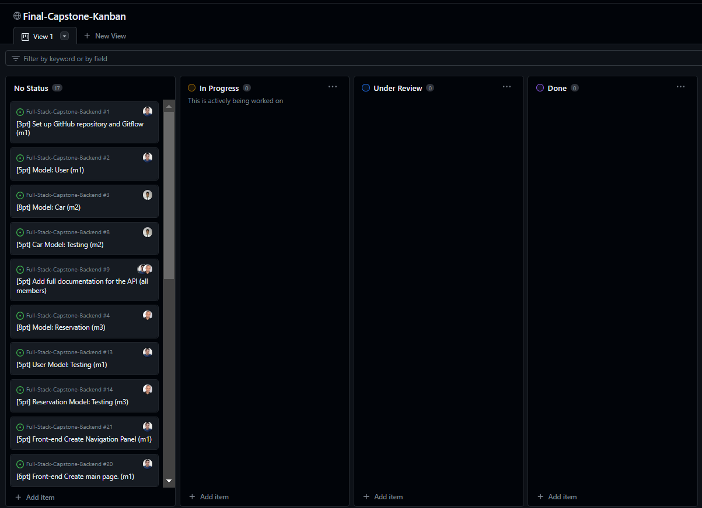
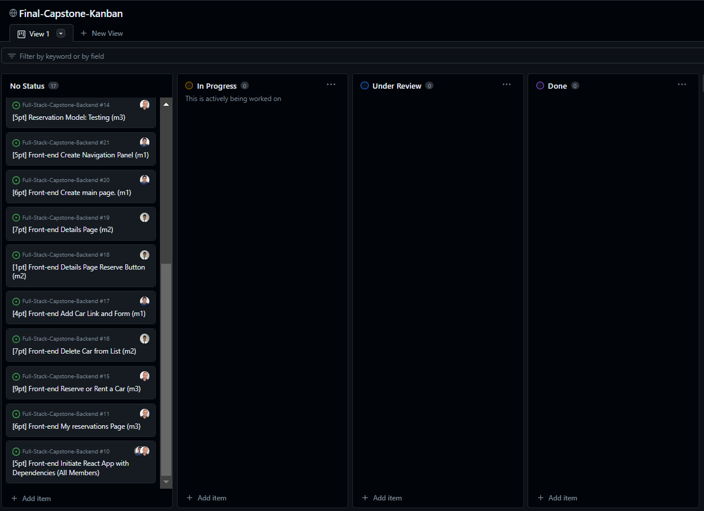

<a name="readme-top"></a>

<!-- TABLE OF CONTENTS -->

# 📗 Table of Contents

- [📖 About the Project](#about-project)
  - [Kanban Board](#kanban-board)
  - [🛠 Built With](#built-with)
    - [Tech Stack](#tech-stack)
    - [Key Features](#key-features)
  - [🚀 Live Demo](#live-demo)
- [💻 Getting Started](#getting-started)
  - [Setup](#setup)
  - [Prerequisites](#prerequisites)
  - [Usage](#usage)
- [👥 Authors](#authors)
- [🔭 Future Features](#future-features)
- [🤝 Contributing](#contributing)
- [⭐️ Show your support](#support)
- [🙏 Acknowledgements](#acknowledgements)
- [📝 License](#license)

<!-- PROJECT DESCRIPTION -->

# 📖 Book a Reservation - Frontend <a name="about-project"></a>

**Book a Reservation** is a full-stack web application that lets the user:

- See a list of cars
- See the details of each car
- Make a reservation to the a car
- Add a car Item
- Delete a car Item
- List all reservations for a given car

This is the frontend side of the project. You can go to the backend side following this link:

https://github.com/ezraermy/Full-Stack-Capstone-Backend

In this project, we had a team of 3 members.

## Kanban Board <a name="kanban-board"></a>

This is the link to the kanban board:
https://github.com/users/ezraermy/projects/3




## 🛠 Built With <a name="built-with"></a>

### Tech Stack <a name="tech-stack"></a>

<details>
  <summary>Client</summary>
  <ul>
   <li>HTML</li>
   <li>CSS</li>
   <li>React</li>
   <li>Redux</li>
  </ul>
</details>

<details>
  <summary>Server</summary>
  <ul>
    <li>Ruby on Rails</li>
  </ul>
</details>

<details>
<summary>Database</summary>
  <ul>
    <li>PostgreSQL</li>
  </ul>
</details>

<!-- Features -->

### Key Features <a name="key-features"></a>

- See a list of cars
- See the details of each car
- Make a reservation to the car
- Add a car Item
- Delete a car Item
- List all reservations for a given car

<p align="right"><a href="#readme-top">👆</a></p>

<!-- LIVE DEMO -->

### 🚀 Live Demo <a name="live-demo"></a>

You can find the live demo [here!](https://rent-a-car-front-end.onrender.com/)

<p align="right"><a href="#readme-top">👆</a></p>

<!-- Getting Started -->

## 💻 Getting Started <a name="getting-started"></a>

To run the project locally, follow these steps.

### Prerequisites

In order to run this project you need to:

- Install [Git](https://git-scm.com/)
- Install [Node](https://nodejs.org/en/download)
- Install a code editor, We suggest [VsCode](https://code.visualstudio.com/)

### Setup

Clone the repo into your local machine:

```bash
git clone https://github.com/PabloEGonz/full-stack-capstone-front-end
```

Install the dependencies:

```bash
npm install
```

### Usage

To start you can open your terminal and in the folder write

```bash
npm start
```

<p align="right"><a href="#readme-top">👆</a></p>

<!-- AUTHORS -->

## 👥 Authors <a name="authors"></a>

👤 **Ezequiel Gonzalez**

- Twitter : [@PabloEGonz](https://twitter.com/PabloEzGon)
- GitHub : [@PabloEGonz](https://github.com/PabloEGonz)
- LinkedIn: [Ezequiel Gonzalez](https://www.linkedin.com/in/pablo-ezequiel-gonz%C3%A1lez-ramos-b9b854265/)

👤 **Ezra Yehuwalashet**

- GitHub: [@ezraermy](https://github.com/ezraermy)
- Twitter: [@ezraermy](https://twitter.com/ezraermy)
- LinkedIn: [Ezra Yehuwalashet](https://www.linkedin.com/in/ezra-yehuwalashet/)

👤 **Yoseph Addisu**

- GitHub: [@yosaddis](https://github.com/yosaddis)
- Twitter: [@yosaddis](https://twitter.com/yosaddis)
- LinkedIn: [Yoseph Addisu](https://linkedin.com/in/yoseph-addisu-abate)

<p align="right"><a href="#readme-top">👆</a></p>

<!-- FUTURE FEATURES -->

## 🔭 Future Features <a name="future-features"></a>

- Implement authentication
- Implement authorization
- Deploy the app online

<p align="right"><a href="#readme-top">👆</a></p>

<!-- Contributing -->

## 🤝 Contributing <a name="contributing"></a>

Contributions, issues, and feature requests are welcome!

Feel free to check the [issues page](../../issues/).

<p align="right"><a href="#readme-top">👆</a></p>

<!-- Show your support -->

## ⭐️ Show your support <a name="support"></a>

If you like this project leave a start for it.

<p align="right"><a href="#readme-top">👆</a></p>

<!-- ACKNOWLEDGEMENTS -->

## 🙏 Acknowledgments <a name="acknowledgements"></a>

We would like to thank Microverse for helping us in the journey to become a Fullstack developer.

Special thanks to Murat Korkmaz, on providing an awesome design! https://www.behance.net/gallery/26425031/Vespa-Responsive-Redesign

<p align="right"><a href="#readme-top">👆</a></p>

<!-- LICENSE -->

## 📝 License <a name="license"></a>

This project is [MIT](./LICENSE) licensed.

<p align="right"><a href="#readme-top">👆</a></p>
